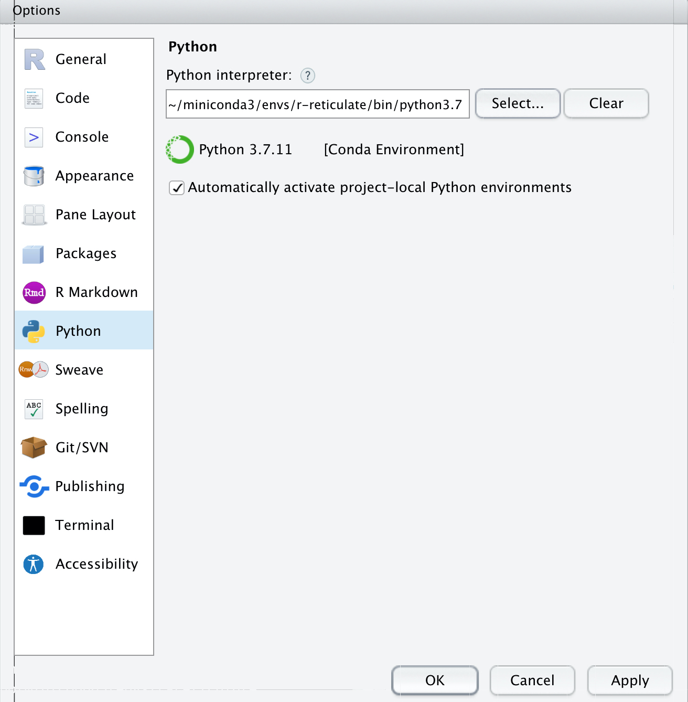

# BSDE: Barycenter Single-cell RNAseq Differential Expression analysis for case-control studies


## Installation
```r
# install.packages("devtools")
devtools::install_github("mqzhanglab/BSDE")
```

In case of missing dependency, the following R packages need to be installed from [BioConductor](https://bioconductor.org/):
```R
if (!requireNamespace("BiocManager", quietly = TRUE))
    install.packages("BiocManager")
BiocManager::install("scater")
BiocManager::install("SingleCellExperiment")
```

### Python dependency

Additionally, the package calls (via [reticulate](https://rstudio.github.io/reticulate/)) Python module [POT](https://pythonot.github.io/) to compute optimal transport. To things work properly, POT should be pre-installed in a [conda](https://docs.conda.io/en/latest/) environment named `r-reticulate`. This can be set up automatically the first time BSDE is loaded. 

But if that fails, you can install manually:

1. First, make sure conda/miniconda is installed. You can follow the instructions [here](https://conda.io/projects/conda/en/latest/user-guide/install/index.html).

2. Run the following in a terminal (line by line):

   ```bash
   conda create --name r-reticulate python=3.7
   conda activate r-reticulate
   conda install -c conda-forge pot
   ```

#### Still have problem loading?

If you are using [RStudio](https://www.rstudio.com/), make sure the Python interpreter is not overridden to something else. In the `Preferences` → `Python`, select interpreter from the `r-reticulate` conda environment. Then, restart R and try `library(BSDE)`. You should be able to see message "Python environment loaded".




## Examples

See [here](https://github.com/mqzhanglab/BSDE/blob/main/simulation) to find examples based on the simulated data.

See [here](https://github.com/mqzhanglab/BSDE/blob/main/realdata_analysis) to find the example for the real data analysis about the [idiopathic pulmonary fibrosis](https://www.ncbi.nlm.nih.gov/pmc/articles/PMC5135277/).

